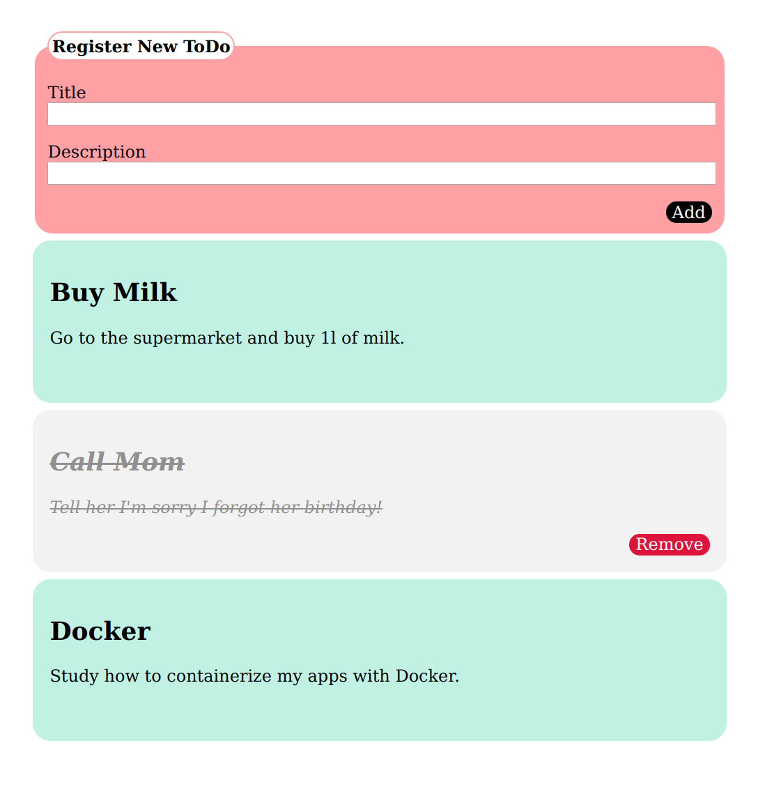

# Vanillajs & localstorage Todo App

## Todo App

This was a weekend test where I had to create a fully functional SPA todo app without any frameworks or libraries. 

### UI Requirements
* Initially, the list of todo cards should be empty.
* There should be a form where the user can add a new 'todo'.
* When a new todo task is submitted from the form, a new todo card should be appended to the list.
* Clicking on a todo card should visually mark the card as done. Exactly how is up to you.
* Add a remove-button to cards marked as 'done'. When the button is clicked, the card should be removed from the board.
* Move the cards marked as 'done' to the bottom of the list.

### Technical requirements
* Keep the application state in an object - the state must *NOT* be depedent on the DOM. The view should be dependent on the state, not the other way around. In its simplest form, this means that the state would be the list of todo’s stored as an array.
* Persist in localstorage. This is actually trivial once you have a state object: store the current state in the browser's localstorage. When the app is closed and then opened again, the state should be restored.
* Lint your code with Airbnb’s ESlint-configuration

### Optional (yes, really!) functionality
Take the opportunity to boost your app and use it in your portfolio! The list below contains additional functionality that is optional to implement. Treat them as suggestions.
You are free to add other functionality (as long as the requirements above are still fulfilled) to your app if you come up with something better.
* Add date and a timestamp to the cards. Sort the cards based on the timestamp. (Cards marked as done should still be in the bottom of the list)
* Let the user decide whether to sort the cards in ascending or descending order.

|  |
|:---:|
| Example of a todo app |
test
